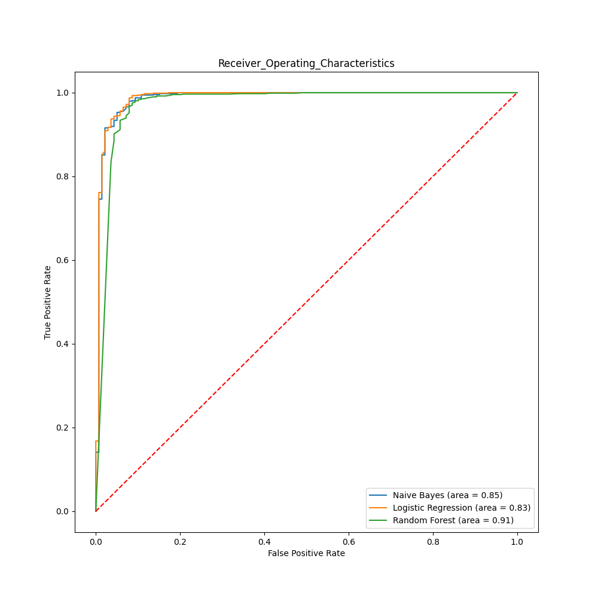

# Spam Mail Detection System

## Table of Contents
- [Project Overview](#project-overview)
- [Dataset](#dataset)
- [Usage](#usage)
- [Machine Learning Models](#machine-learning-models)
- [Evaluation](#evaluation)
- [ROC Curve](#roc-curve)
- [License](#license)
- [Acknowledgments](#acknowledgments)
- [FAQ](#faq)
- [Changelog](#changelog)

## Project Overview

This is a spam mail detection system implemented using Python and scikit-learn. It classifies emails as either "spam" or "ham" (non-spam) based on their content.

## Dataset

The dataset used in this project contains a collection of emails with labels indicating whether each email is spam or not. The dataset has been preprocessed to remove duplicates and null values.

## Usage

1. Open the Jupyter Notebook for this project in Google Colab by clicking the "Open in Colab" badge below:
   
   - Make sure you have a Google Colab account or are logged in to your Google account to access and run the notebook.

2. Run the code cells and experiment with the spam mail detection system.

3. Feel free to modify the code or dataset to suit your specific needs or experiment with different machine learning models.

4. If you have any questions or encounter issues, please refer to the [FAQ](#faq) section for answers to common questions or reach out for support.

5. If you find this project helpful, consider giving it a star on GitHub to show your support and appreciation.

## Machine Learning Models

In this project, we've implemented several machine learning models for spam mail detection. Here's a brief overview of each model's performance:

- **Multinomial Naive Bayes:**
  - Classification accuracy on the training data: 98.01%
  - Classification accuracy on the test data: 96.03%

- **Logistic Regression:**
  - Classification accuracy on the training data: 96.19%
  - Classification accuracy on the test data: 95.45%

- **Random Forest:**
  - Classification accuracy on the training data: 100%
  - Classification accuracy on the test data: 97.19%

## Evaluation

We've conducted a comprehensive evaluation of the machine learning models, including:

- Precision, recall, and F1-score metrics for each classification model.
- Confusion matrices for both training and test data.
- ROC curve analysis to assess model performance.

## ROC Curve

To visualize the performance of our models in distinguishing between spam and non-spam emails, we've included an ROC (Receiver Operating Characteristic) curve. The ROC curve plots true positive rates against false positive rates.

For more details and to explore the code, please refer to the Jupyter notebook linked in the "Usage" section.

## License

This project is licensed under the [MIT License](LICENSE). Feel free to use, modify, and distribute the code as per the terms of the license.

## Acknowledgments

We'd like to acknowledge the contributions and support of [mention any contributors, libraries, or resources that have been valuable to your project].

## FAQ

If you have any questions or encounter issues, check out the frequently asked questions [here](#faq) for answers to common queries.

## Changelog

We maintain a changelog to track updates and changes to the project. See the [changelog](CHANGELOG.md) for version history.
